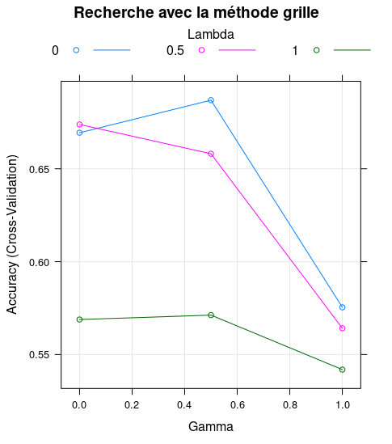

## I - Introduction 

Nous allons traiter deux types de problèmes : un problème de régression et un problème de classification. Chacun de ces problèmes a un jeu de données spécifiques. Ils seront abordés avec des méthodes similaires, mais utilisant des approches différentes. Le problème de régression a pour objectif d'estimer la valeur de sortie et le problème de classification doit sélectionner une classe de sortie. Les données que nous allons utiliser proviennent d'une source inconnue. Les modèles et informations qui sont mises en avant dans ce rapport seront extraits du jeu de données exclusivement. 

## II - Classfication 

### 1. Analyse Exploratoire 

Dans un premier temps, avant d'appliquer des modèles pour apprendre sur les données à notre disposition, nous allons les analyser pour en extraire une structure et des informations intéressantes. Le jeu de données est constitué de 50 prédicteurs et une variable de sortie `Y` qui est la classe recherchée. Cette classe est composée de 3 types : `1`,`2` et `3`. Les prédicteurs quant à eux sont des variables quantitatives, avec pour certains d'entre eux qui prennent des valeurs entières et d'autres des valeurs réelles. Cet apprentissage des données est d'autant plus difficile qu'aucune information complémentaire est donnée par rapport aux prédicteurs ou encore la classe. Nous ne pouvons donc pas nous appuyer sur des connaissances extérieures ou sur un domaine particulier, mais seulement les informations inhérentes. Cette analyse exploratoire sera justement un très bon moyen d'en savoir plus sur les données manipulées. 
La dimension $p=50$ qui est assez importante rend l'affichage très difficile, mais nous pouvons néanmoins utiliser une première approche avec les diagrammes en boîtes pour analyser la répartition des valeurs selon les classes : 

{ width=50% }

Cette première approche nous permet de distinguer 3 types de comportements des variables. La première partie, avec très peu de changement et des comportements très similaires entre les classes. La deuxième partie, on observe beaucoup de changements, mais les comportements restent assez similaires entre les classes. Et pour finir la troisième partie avec peu de changement, mais une plus grande distinction entre les classes. On peut supposer que certaines variables expliquent mieux la classe obtenue en sortie. 

Nous allons donc essayer d'extraire les prédicteurs les plus parlants, qui expliquent le mieux la classe recherchée. Pour cela, on applique l'ACP : *Analyse en Composante Principale* (PCA). On remarque très rapidement, que cette approche semble peu concluante, avec aucune dimension dominante ou très explicative. Une seconde méthode qui peut être abordée est l'ACF : *Analyse en Composante Factoriel* (LDA), qui est issue d'une méthode par apprentissage supervisé contrairement à l'ACP qui utilise un apprentissage non supervisé. 

{ width=45% }{ width=45% }

On remarque néanmoins que la méthode ACF permet de visualiser la répartition des données en deux dimensions. On peut imaginer des frontières de forme linéaire ou quadratique, mais reste limitée, car des erreurs persisteront à vue d'œil. Les données sont très concentrées en son centre avec quelques points bien distincts entre les classes, mais malheureusement, ce n'est pas la majorité.  

Les données auront des taux d'erreurs très certainement assez élevées dû à la difficulté à les classifier. La structure des données inhérentes rend difficile la répartition dans l'espace. Les méthodes qui seront à privilégier sont des méthodes d'apprentissage supervisé. 

### 2. Application des méthodes d'apprentissage 

Dans cette partie, nous allons chercher un modèle qui apprend et permet d'estimer la classe de la manière la plus fiable possible. Chaque modèle appris sera réalisé sur les $p=50$ prédicteurs à disposition. Nous n'avons pas réalisé la sélection d'un sous-modèle avec les méthodes `best subset selection`, `forward stepwise selection` ou encore `backward stepwise selection` car cette sélection est basée sur le choix du plus grand $R^2$, la variance expliquée par la régression. Cette valeur est obtenue avec $R^2=1-\frac{RSS}{TSS}$ qui peut être calculée avec la regression, mais pas dans le cadre de la classification. Les méthodes d'extractions des fonctionnalités comme l'ACP ou encore l'AFD n'ont pas fait émerger de dimensions ou de prédicteurs dominant, ainsi nous avons pris la décision de faire apprendre les modèles sur tous les prédicteurs.  

Pour évaluer les différents modèles réalisées, nous allons estimer l'erreur directe de prédiction avec la méthode de validation croisée imbriquée (`nested cross-validation`). Cette approche a de nombreux avantages : elle permet d'utiliser toutes les données que cela soit en données d'apprentissage ou de validation. Ainsi, la valeur obtenue ne dépend pas des données observées mis dans l'ensemble de l'apprentissage. On réalise le test plusieurs fois ce qui permet d'obtenir une estimation de l'erreur stable. À cela, s'ajoute aussi la possibilité de réaliser une validation croisée interne pour estimer les meilleurs hyperparamètres du modèle pour ensuite évaluer sa performance. Dans notre cas, nous avons divisé les données en 10 parties `n-folds=10` avec des données externes et internes. Pour certains modèles, les données internes ne seront pas utiles, car il n'y a pas d'hyperparamètre à estimer. 

Différentes méthodes  vues en cours ont été appliquées. La méthode des *K plus proches voisins (KNN)* permet d'assigner à une observation une classe en fonction de ses voisins dans un espace euclidien de dimension $p=50$. La dimension est trop importante pour être représentée, mais ici ce qui nous intéresse est de choisir le meilleure K. Le $K$ est choisi avec une validation croisée internet avec $bestK=11$. La valeur de $K$ ne doit être ni trop grande ni trop petite pour éviter un sur apprentissage ou une trop grande généralisation. 
La méthode *naïve Bayes* est une méthode qui utilise le théorème de Bayes de manière à choisir la classe avec la plus haute probabilité conditionnelle. Pour être optimale on doit connaître la probabilité conditionnelle de chaque classe. Par contre, pour appliquer ce modèle, on fait l'hypothèse d'une forte indépendance conditionnelle et que les matrices de covariances sont égales entre-elles. Cela simplifie énormément le modèle, mais cela ne signifie pas pour autant qu'on obtiendra de mauvaises performances. Le modèle *analyse discriminante linéaire* (LDA) quant à lui réalise des hypothèses moins fortes que naïve Bayes avec l'homscédasticité et la normalité. On peut aussi utiliser le modèle *analyse discriminante quadratique* (QDA) qui ne fait plus l'hypothèses sur l'homoscédasticité mais suppose qu'il y a une matrice de variance par variable et non plus, une seule commune. Cela permet de modéliser des modèles non-linéaires. Néanmoins les différences entre les deux modèles restent assez faibles en règle générale. Nous avons aussi appliqué l'*analyse discriminante régularisée* (RDA) qui permet avec sa règle de décision $\lambda$ et $\gamma$ de varier entre l'analyse discriminante linéaire et l'analyse discriminante quadratique. Cela permet un contrôle de la contribution des estimateurs des matrices de variance $\hat\Sigma_i$ et ainsi réduire l'importance de certaines variables et de lisser. Cette méthode se comporte très bien quand il y a beaucoup de prédicteurs. Pour sélectionner les meilleures valeurs des paramètres de régularisation, on utilise la validation croisée interne avec deux types d'approches : une recherche `grid` avec une routine bien spécifique et une recherche `random` qui utilise la procédure de Bergstra et Bengio. Parmi les deux approches on prendra la meilleure. Voici des exemples de graphes obtenus avec cette recherche avec les schémas ci-dessous. Nous avons aussi appliqué des variantes de ces modèles avec l'*analyse discriminante flexible* (FDA) et l'*analyse discriminante mixte* (MDA). Le modèle FDA utilise des combinaisons non-linéaires des prédicteurs. Le modèle MDA fait l'hypothèse que les classes sont des mixtes gaussiennes. 

{ width=30% }   { width=30% }    { width=30% }

La méthode de *régression linéaire* a été appliquée au jeu de données pour rechercher des frontières linéaires entre les classes. Elle est appliquable pour des modèles binaires et multi-classes. Dans notre cas, nous devons obtenir trois régions distinctes. Pour être appliqué, on fait l'hypothèse d'homoscédasticité, de normalité des termes d'erreur et que les variables explicatives sont non colinéaires. Pour aller plus loin, on peut utiliser la *régression ridge* ($\alpha=0$) qui permet d'imposer des pénalités sur les coefficients. L'objectif est de rechercher le meilleur $\lambda$ qui gère la dose de régression et fait tendre les coefficients vers $0$. Pour trouver le meilleur $\lambda$ on utilise là aussi la validation croisée interne. Pour que la méthode soit plus efficace, on standardise les prédicteurs, standardisation aussi nomée `Z-Score Normalization` avec $z=\frac{x-\mu}{\sigma}$, mais les résultats obtenus n'ont montré qu'une augmentation du taux d'erreur de validation. Une autre alternative est d'appliquer la méthode *régression du lasso* ($\alpha=1$). Cette méthode permet de sélectionner des prédicteurs et d'apprendre sur un sous-ensemble, en annulant certaines valeurs avec les coefficients. L'apprentissage s'effectue sur seulement les prédicteurs significatifs. Là aussi, on applique la validation croisée interne pour rechercher le meilleur $\lambda$. Il est inutile de comparer les valeurs des $\lambda$ trouver avec la méthode Lasso ou Ridge, car ils ne répondent pas au même problème. 
Une manière de combiner les propriétés de la régression ridge et lasso est d'utiliser la *régression elastic net*. L'objectif est de trouver les meilleurs paramètres $\alpha$ et $\lambda$ avec une validation croisée interne. Les schémas ci-dessous illustrent la recherche des paramètres selon la méthode appliquée : 

{ width=30% }           { width=30% }   { width=45% }

Pour terminer, la méthode régression logistique multinomiale a été appliquée sur le jeu de données. C'est un algorithme de classification probabiliste. On généralise la méthode de régression logistique à plusieurs classes. Pour cela on suppose que les $x_i$ sont fixés et on estime les probabilités conditionnelles de $P_k(x)$. Nous avons utilisé deux méthodes différentes. La première avec la régression logistique avec `family = "multinomial"` et la seconde en utilisant `multinom` basé sur le réseau de neurones. 

### 3. Conclusion 
Pour afficher les performances des différentes méthodes appliquées sur le jeu de données, plusieurs solutions sont à notre disposition. Une très bonne visualisation du rapport sensibilité et spécificité sont les courbes `ROC`. Malheureusement, nous avons un problème de classification à trois classes, et le calcul de la sensibilité et spécificité ne peut pas être réalisé. Il faudrait pour cela réduire à deux classes, mais les résultats obtenus seraient non interprétables. 
Pour cela, on va évaluer la performance des modèles sur l'erreur de classification calculée avec la formule : 
$$
Err_\mathcal{T}=\frac{1}{m}\sum_{i=1}^m I[y_i \ne \hat{y_i}]
$$
L'erreur de classification est réalisée sur une validation croisée imbriquée. Cette validation croisée permet de calculer l'erreur à l'aide de toutes les observations de notre jeu de données et de répéter plusieurs fois cette démarche pour obtenir une valeur non-biaisée grâce aux tests de validations externes. Les données ont été partitionnées en 10 sous-ensembles, avec la répartition des taux d'erreur illustrés dans le schéma ci-contre avec le diagramme en boîte. Un schéma à côté illustre les intervalles de confiances de ces erreurs pour chaque modèle : 

{ width=50% } 
{ width=50% }
Les taux d'erreurs obtenus peuvent varier de $\pm 3 \%$ selon la répartition des sous-ensembles dans le jeu de données lors de la construction des ensembles avec la validation croisée imbriquée. Cela signifie que pour deux exécutions différentes les valeurs diffères légèrement. Cela montre bien l'efficacité d'une validation croisée et la stabilité des taux d'erreurs obtenue. Cela nous permet de conclure que le modèle analyse discriminante régularisée avec $\gamma=0$ et $\lambda=0.5$ est le modèle le plus performant parmi les modèles testés. Il permet de faire un compromis entre LDA et QDA. La régression logistique est un très mauvais modèle et montre que les frontières ne sont pas strictement linéaires. Ceci est aussi mis en avant avec la grande différence de performance entre LDA et QDA. Des frontières quadratiques permettent de mieux délimiter les classes dans l'espace. Les K plus proches voisins ne sont pas un modèle représentatif des données non plus. Ceci a déjà été constaté très rapidement avec l'analyse exploratoire lorsqu'on affiche les données dans un plan. On remarque que les classes sont très proches l'une de l'autre dans l'espace avec quelques exceptions. Les schémas montrent aussi que la méthode Lasso a des meilleures performances que la méthode Ridge. Ceci peut-être expliqué par le faite que la méthode Lasso apprend sur seulement les prédicteurs les plus significatifs. L'apprentissage sur un ensemble de données plus réduit en prédicteurs semble être bénéfique.  

## III - Régression 
### 1. Analyse exploratoire

Dans cette partie du projet, nous abordons un problème de régression. Notre jeu de données est constitué de 100 variables quantitatives en nombres réels toutes positives. Une analyse très rapide avec un diagramme en bâton de toutes les valeurs montre que les valeurs prises des prédicteurs restent dans un domaine assez réduit alors que les valeurs prises de $y$ sont beaucoup plus dispersées. Une visualisation toute simple des valeurs $y$ sur un de ses prédicteurs donne une visualisation très grossière du comportement. Cela met en avant aussi que les valeurs $y$ peuvent être négatives ou positives. Aucune information supplémentaire est donnée sur le type d'informations que nous étudions, on doit donc se fier seulement aux informations inhérentes de ce jeu. Ce dernier contient 500 observations et aucune valeur n'est vide dans le tableau. On suppose que les informations ont toutes bien été complétées.Pour aller plus loin dans cette analyse, on peut utiliser la distance de Cook. Cette distance permet de visualiser les données qui sont plus affluentes que les autres et estimer s'il existe des valeurs aberrantes (`outliers`). Cela dépend beaucoup des résidus et l'influence des valeurs de $x$ et de $y$ dans les observations. L'objectif est de supprimer des observations une par une et de voir son influence. Quand cette distance est importante, on remarque que ce point de donnée influence beaucoup l'estimation des valeurs. Néanmoins nous avons pris la décision de garder toutes les oberservations lors de notre apprentissage. Ces réflexions sont illustrées par les trois schémas ci-dessous qui mettent en avant cette analyse du jeu de données : 

{ width=33% }
.png){ width=33% }   { width=33% }   

#### Signification de la régression 

Nous essayons d'abord d'effectuer directement une analyse en utilisant un modèle linéaire sur les 100 prédicteurs et la variable de sortie $Y$. Nous avons une p-value de $2.2e^{-16}$ qui est suffisamment petite pour conclure que la régression est significative. Cela permet aussi de voir quels sont les coefficients qui sont significatifs dans ce modèle. 

Nous utilisons respectivement Durbin-Watson et Shapiro-Wilk pour détecter si les résidus de l'échantillon sont indépendants et conformes à la distribution normale. Pour le test de Durbin-Watson, on fait les hypothèses suivantes : $H_0$ l'indépendance et $H_1$ les résidus sont indépendants. On a $p-value = 0.3588$ assez grande pour ne pas rejeter l'hypothèse $H_0$ et conclure que les résidus sont indépendants. Pour le test de Shapiro-Wilk, hypothèse nulle est l'échantillon suit une loi normale. Par conséquent si la p-value du test est significative, l'échantillon ne suit pas une loi normale. Le degré de signification vaut $0.1751$. Ce n'est pas suffisament faible ($<0.05$), il ne faut donc pas rejeter l'hypothèse nulle de normalité à tort. Donc les résidus suivent une loi normale.

### 2. Sélection des prédicteurs

Puisque les prédicteurs sont très nombreux dans l'ensemble de données, et il n'y a aucune garantie que tous les prédicteurs soient significatifs pour la régression. On décide donc d'utiliser *Subset Selection Methods* pour trouver le meilleur modèle. Premièrement, on a essayé *Best Subset Selection*, mais son temps d'exécution est beaucoup trop long. Ceci est complètement compréhensible car notre dimension $p=100$ est très large. La recherche de tous les modèles possibles est très long à cause de la méthode combinatoire qui demande un temps de calcul monstrueux. Un moyen de contourner ce problème est d'utiliser une *méthode pas à pas*. Bien sûr cette méthode est une très bonne heuristique mais ne permet pas de garantir que le modèle est optimal, néanmoins elle est beaucoup moins couteuse en temps de calcul. Nous utilisons la méthode pas à pas montant et la méthode pas à pas descendant pour trouver les prédicteurs dont nous avons besoin. Ensuite on choisit le modèle avec la plus petite erreur. Cela permet aussi de connaitre le nombre de prédicteurs nécessaire pour celui-ci pour obtenir de bonnes performances. Les figures ci-dessous montrent les espérances de l'erreur obtenue en fonction du nombre de prédicteurs dans les cas des méthodes pas à pas montant et pas à pas descendant. On remarque que ces deux approches différentes trouvent le même nombre de prédicteurs soit 65. Sachant que dans l'un on ajoute progressivement les meilleurs prédicteurs et dans l'autre on retire un à un les prédicteurs les moins significatifs. 

{width=50%}
{width=50%}

### 3. Recherche du meilleur modèle

La méthode régression linéaire utilisée avec la fonction `lm()` dans R permet de produire un modèle principal de régression. $Y_i = \beta_0 + \beta_1x_1 + ... + \beta_nx_n + \epsilon_i$ où $Y_i$ et les $x_i$ sont fixes et $\epsilon_i$ représente l'erreur. Nous avons utilisé la régression linéaire multiple car c'est un modèle très simple de prédiction de variables décrites par plusieurs prédicteurs. Nous supposons qu'il existe une relation linéaire entre $Y$ et les $p$ différents prédicteurs soit notre vecteur $X$.

La régression polynomiale décrit la variation d'une variable expliquée à partir d'une fonction polynomiale d'une variable explicative. C'est un cas particulier de régression linéaire multiple où les observations sont construites à partir des puissances d'une seule variable. La transformation effectuée sur les $100$ prédicteurs est une transformation polynomiale jusqu'au degré $2$. Cependant on remarque qu'aucun terme quadratique, excepté la variable $x_{64}^2$, n'est significatif pour la régression. Cela montre qu'il n'a pas réellement de relation quadratique entre $X$ et $Y$. On peut représenter ce modèle de cette manière : 

$$
P_n(x) = a_nx^n + a_{n-1}x^{n-1} + ... + a_1x + a_0
$$
ce qui permet d'écrire $Y_i = P_n(X_i) + \epsilon_i$ avec le résidu $\epsilon_i$ étant la plus petite valeur dans le sens des moindres carrés.

Les méthodes pas à pas cherchent à améliorer la prédiction du modèle de régression linéaire en utilisant seulement une partie des prédicteurs les plus utiles. Cela permet d'avoir une précision de prediction plus élevée et un meilleur pouvoir explicatif du modèle. D'autres alternatives existes. En utilisant la méthode du Lasso, on peut réduire les coeffcients de certaines variables à $0$ et ainsi faire sortir les variables inutiles. Nous avons aussi utiliser le modèle de régression Ridge même si ce modèle ne réduit pas le nombre de prédicteurs utilisé mais prend en compte toutes les variables dans la prédiction. Ceci est aussi un bon moyen de s'assurer que certaines variables n'ont pas été omises par erreur. Le modèle est très intéressant car il réduit la régression des coefficients en imposant une pénalité sur la taille. Les coefficient ridge minimisent la pénalité de la somme des résidus au carré (RSS). La raison pour laquelle une telle contrainte devrait améliorer l'ajustement n'est peut-être pas immédiatement évidente, mais il s'avère que la réduction des estimations des coefficients peut réduire considérablement leur variance. 
La méthode Ridge et la méthode Lasso sont très similaires à la méthode des moindres carrés, mais elles ajoutent une pénalité de compression sur la base de RSS. Nous utilisons le paramètre de médiation $\lambda$ pour obtenir la valeur minimale de la formule ci-dessous. Évidemment, pour que cette formule prenne la valeur minimale, lorsque nous ajustons la valeur de $\lambda$, le coefficient $\beta$ de tous les prédicteurs changera en conséquence. Lorsque le $\lambda$ est grand, l'importance de la pénalité de compression devient plus grande, ce qui réduit la valeur estimée du coefficient $\beta$. Il est donc très important de choisir le bon $\lambda$. Nous pouvons obtenir directement le $\lambda$ optimal grâce à la fonction pour minimiser la valeur de la formule. Pour Ridge, le carré de $\beta$ est utilisé dans le terme de pénalité de compression, et la valeur absolue de $\beta$ est utilisée dans le lasso.

$$
\sum_{i=1}^{n}{(y_i - \beta_0 - \sum_{j=1}^{p}{\beta_jx_{ij}})^2} + \lambda\sum_{j=1}^{p}{\beta_j^2} = RSS + \lambda\sum_{j=1}^{p}{\beta_{j}^2}
$$

Pour la méthode des *K plus proches voisins* en régression nous avons utilisé les 65 prédicteurs les plus pertinents avec la méthode de sélection pas à pas. Cela permet de réduire la dimension de $p=100$ à $p=65$, pour améliorer l'efficacité de la méthode KNN qui se comporte moins bien quand les dimensions sont trop importantes. Ceci est dû au fléau de la dimensionnalité. Quand la dimension $p$ est très importante les observations ont tendance à s'éloigner de plus en plus dans l'espace à p-dimension. Cela entraîne de mauvaises performances dans la prédiction de $y$ et il est difficile d'ajuster l'hyper-paramètre $k$ pour cette méthode. En réalisant quelques tests, on réalise que la méthode KNN n'est pas du tout adaptée dans l'estimation de $y$ et nous avons donc pris la décision de ne pas garder ce modèle. 

### 4. Conclusion
Pour évaluer la performance des différents modèles réalisées, nous avons cherché à calculer pour chacun la sommes de résiduels aux carrés. Nous choisirons le modèle avec la plus petite erreur quadratique moyenne (MSE) calculée comme le montre la formule ci-contre : 
$$
MSE = \frac{1}{n}\sum_{i = 1}^{n}{(y_i - \hat{y_i})^2} 
$$
Cette erreur calculée est réalisée avec validation croisée répétée une cinquantaine de fois pour obtenir l'erreur la plus stable possible. Le schéma ci-contre illustre la répartition des différentes valeurs de MSE obtenues pour chacun des modèles avec une représentation en boîte à moustache. Un second schéma montre l'intervalle de confiance cette fois-ci des MSE obtenues pour ces différents modèles.  

{width=50%}
{width=50%}

On a constaté précédemment que les méthodes de sélection pas à pas montant et pas à pas descendant obtiennent la même erreur minimum qu'avec la régression linéaire. Cette sélection des prédicteurs améliore significativement les performances de la régression linéaire. La méthode *Regression quadratique Linéaire* ne semble pas être un très bon modèle pour ce jeu de données, car on obtient une erreur beaucoup plus élevée comparée aux autres méthodes. Les méthodes Ridge et Lasso font une réduction des coefficients de régression de manière à tendre vers zéro. Mais dans cet ensemble de données, la méthode Lasso filtre seulement 9 paramètres, c'est-à-dire que 91 paramètres sont retenus et utilisés dans l'apprentissage. Le nombre de paramètres reste encore assez important comparé aux résultats avec les méthodes pas à pas. Cela peut être la raison pour laquelle **la méthode de régression linéaire avec les 65 prédicteurs** sélectionnés avec la technique de pas à pas à de meilleures performances. La simplicité d'un modèle permet parfois d'améliorer les performances et rend le modèle beaucoup plus interprétable. 

